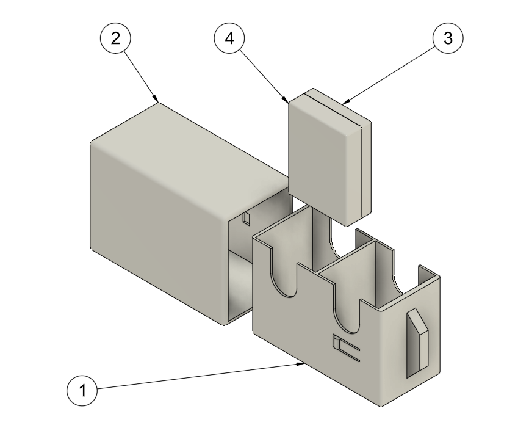
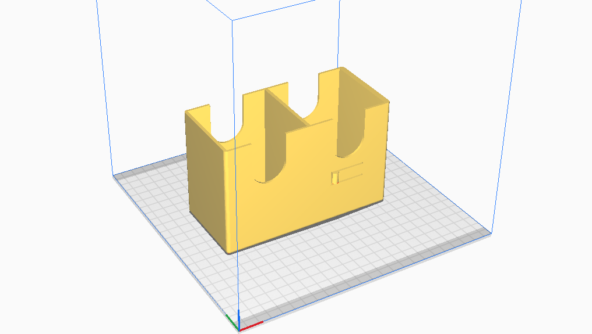
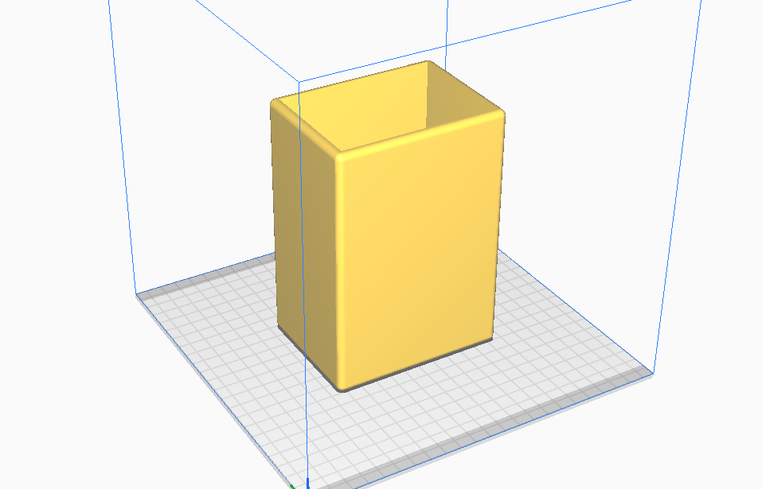
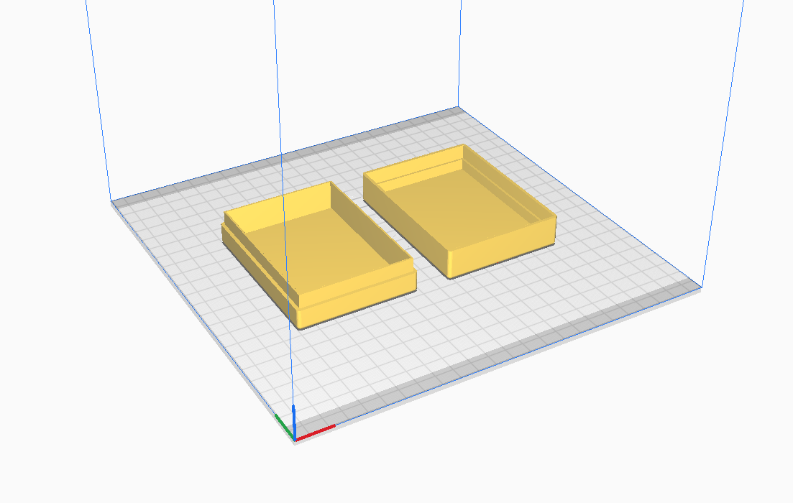

# Proyecto de Caja Porta Mazos de TCGs
En este repositorio se encuentran los diseños e instrucciones para una caja portadora de mazos de juegos de cartas, en específico para *Magic The Gathering* en formato *commander* con sus accesorios.

Esta caja fue diseñada para ser impresa en 3D por medio de máquinas FDM con PLA.

# MTG BOX

Estan disponibles los archivos de fabricación y de objeto 3D en las carpetas `printing` y `model` respectivamente. Dentro de la carpeta `img` se encuentran las imágenes del proyecto.

### Objeto 3D:
* Fusion 360 f3d
* STEP

### Fabricacion:
* STL

# Diseño del objeto

El objeto fue diseñado en Fusion 360 para ser impreso en 3D por FDM con filamento PLA. Esta compuesto por 4 piezas que se numeran del 1 al 4.

Las dimensiones de los compartimientos consideran un mazo de formato commander de 100 con protectores estándar de plástico Dragon Shield.

* 1 **Tray**: Compartimiento para almacenar las cartas
* 2 **Cover**: Cubierta del **tray**
* 3 **Dices_tray**: Caja de accesorios
* 4 **Dices_cover**: Tapa de la caja de accesorios

Los modelos 3D estan disponibles en extensión STEP y Fusion 360 f3d

# Fabricación

Para fabricar el objeto hay que procesar los archivos de mallas con Ultimaker Cura con las siguientes orientaciones para cada pieza para una impresión óptima.

El **Tray** se puede cortar sin ninguna modificación ni corrección de posición adicional, pero se deben utilizar soportes para la correcta impresión del mecanismo de cierre.

**Cover** se debe rotar en 90 grados tal que la cara plana opuesta a la apertura quede tocando la cama de la impresora para no utilizar soportes excesivamente, se recomienda utilizar sujeciones del tipo "Brim"

Se pueden imprimir ambas piezas de los **Dices** en la misma tanda, al importar las piezas solo se deben correr dentro de la cama para que estas no se superpongan.

### Parametros de impresión:
* Infill: 20%
* Altura de capa: 0.2 mm
* Boquilla 0.4mm (Para mejorar la velocidad de impresión se puede utilizar una boquilla de 0.8mm)
* Ancho de pared 1.6mm
* Temperatura de estrusor 210°
* Temperatura de cama 60°
* Velocidad según capacidades de la impresora

Si la impresora es muy precisa se recomienda modificar la protuberancia del mecanismo de sujeción en un aumento de 0.75mm. Para uso de una Ender 3 tradicional se puede mantener la protuberancia original.

Protuberancia de sujeción a modificar dependiendo del caso.

# Ensamblaje

Para ensamblar la caja solo es necesario introducir las cartas a guardar en los compartimientos con la cara de la carta orientada a la ranura de retiro y opcionalmente introducir los accesorios en la caja de dados y colocarlo a la par con las cartas. Luego introducir el **Tray** con las cartas en el **Cover** con la manilla de retiro hacia afuera.

El sistema de cierre tiene una sola posición, por lo que si al cerrar la caja no se mantiene cerrada por su propio peso, rotar el cover en 180°.

Más imágenes disponibles en la carpeta `img` y el diagrama técnico del modelo esta en el pdf `Diagrama.pdf`
